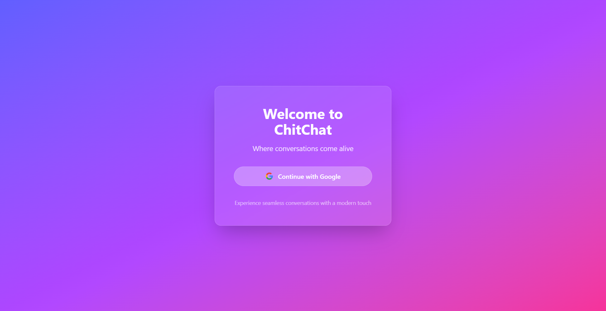
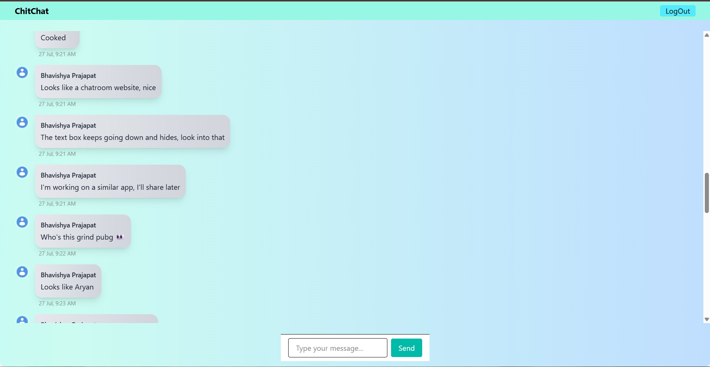

# 🌐 Real-Time Global Chat App

A sleek, real-time chat application built with **React**, **Firebase Firestore**, and **Tailwind CSS**.  
Designed for instant communication in a shared global chat room, with a smooth UI and animated background.

---

## ✨ Features

- 🔥 **Real-time messaging** with Firebase Firestore
- 🪄 **Beautiful animated gradient background** (cyan, turquoise, teal, blue mix)
- 🧍‍♂️ **User-friendly message styling** (different styles for sender & receiver)
- 📜 **Auto-scroll** to the latest message
- ⌚ **Timestamps** for messages
- 🖼 **User avatars**
- 🖋 *(In Progress)* **Typing indicators** to see when others are typing
- 📱 **Responsive design** for desktop and mobile

---

## 🛠 Tech Stack

- **React** – Frontend library
- **Firebase Firestore** – Real-time database
- **Firebase Authentication** – User login/signup
- **Tailwind CSS** – Utility-first styling
- **date-fns** – Date formatting

---

## 🚀 Getting Started

### 1️⃣ Clone the repository
```bash
git clone https://github.com/Vermadeepakd1/chat-app.git
cd your-repo-name
```

### 2️⃣ Install dependencies

```
npm install
```

### 3️⃣ Setup Firebase

*   Create a Firebase project in Firebase Console
    
*   Enable **Firestore Database** and **Authentication**
    
*   Copy your Firebase config into src/firebase/firebase-config.js
    

Example:

```
import { initializeApp } from "firebase/app";
import { getFirestore } from "firebase/firestore";
import { getAuth } from "firebase/auth";

const firebaseConfig = {
  apiKey: "YOUR_API_KEY",
  authDomain: "YOUR_PROJECT_ID.firebaseapp.com",
  projectId: "YOUR_PROJECT_ID",
  storageBucket: "YOUR_PROJECT_ID.appspot.com",
  messagingSenderId: "YOUR_MESSAGING_SENDER_ID",
  appId: "YOUR_APP_ID"
};

const app = initializeApp(firebaseConfig);
export const db = getFirestore(app);
export const auth = getAuth(app);

```

### 4️⃣ Run the app

```
npm start
```

📸 Screenshots
--------------

### 💻 Landing Page



### ⌨ Chat Page


📌 Roadmap / Future Improvements
--------------------------------

*   ✅ Improved **typing indicator**
    
*   🔔 Real-time **read receipts**
    
*   💬 **Private chat rooms**
    
*   🎨 Customizable themes
    
*   📂 File & image sharing
    

🤝 Contributing
---------------

Contributions, issues, and feature requests are welcome!Feel free to fork the repo and submit a pull request.

📄 License
----------

This project is licensed under the **MIT License** – see the [LICENSE](LICENSE) file for details.

🌟 Show Your Support
--------------------

If you like this project, please **⭐ Star** the repository on GitHub and share it on LinkedIn!